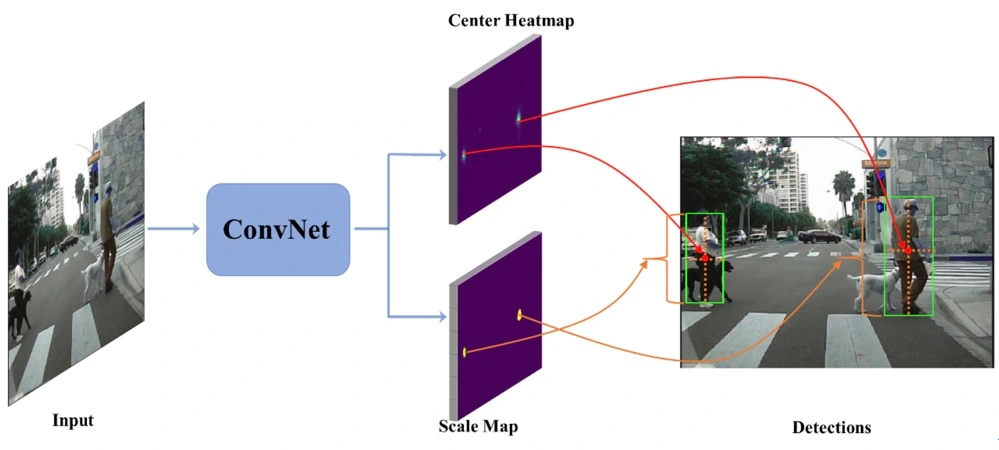

## CSP行人检测：无锚点框的检测新思路

2019/04/09

【导语】本文被收录于CVPR 2019，通讯作者单位为阿联酋起源人工智能研究院（IIAI）。受启发于传统的特征点检测任务和最近的全卷积式关键点检测和配对的工作，本文作者提出了一种无需密集滑窗或铺设锚点框、全卷积式预测目标中心点和尺度大小的行人检测方法，为目标检测提供了一个新的视角。

### 简介

目标检测通常采用传统的密集滑窗的方式或者当前主流的铺设锚点框（anchor）的检测方式，但不管哪种方式都不可避免地需要针对特定数据集设计甚至优化滑窗或锚点框超参数，从而增加了训练难度并限制了检测器的通用性。

能否跳出这种窗口式或锚点框式的限制而实现目标检测？

本文重新回顾了早期的属于低层视觉的特征检测或者感兴趣区域检测的思路，其中大部分是基于卷积式的响应。受此启发，本文把目标检测当作一个具有高阶语义的特征检测任务，为目标检测提供一个新的视角。具体地，像边缘、角点、斑点或感兴趣区域等低层特征检测，本文方法也扫描全图寻求感兴趣特征点，为此卷积是自然胜任的。但跟传统的底层特征不一样的是，本文进一步寻求具有高阶语义的抽象特征点，如行人、人脸等，而当今的深度卷积神经网络已经具备这种高阶语义的抽象能力。此外，类似斑点或感兴趣区域检测，本文也同时为每个中心点预测出目标的尺度，这也是一个直接的卷积式预测。因此，本文以行人检测为例将目标检测简化为一个直接的全卷积式的中心点和尺度预测任务，并将该方法命名为CSP（Center and Scale Prediction）检测器。虽然该检测器结构简单，但在主流的Caltech和Citypersons行人检测数据集中依然达到了当前最好的检测性能，同时具有与单阶段检测器相当的检测速度，因此是个简而可用的新的检测思路。

### 研究动机
在传统的计算机视觉领域，特征点检测是一个非常基础且重要的任务。通常，它被当成是一种低层视觉技术，包括边缘检测、角点（或关键点）检测和感兴趣区域检测等。一般而言，一个特征点通常是图像的一个感兴趣部分，特征点检测是指抽取图像信息并给出每个像素点上是否存在给定的一种特征的决策。而对于图像信息的抽取，当今的深度卷积神经网络（CNN）被认为具有对图像的高度抽象能力，因此CNN也被广泛应用于特征点检测，并取得了非常有吸引力的结果。例如近些年基于CNN的边缘检测方法取得了很大的进展，它们揭示了CNN可以获得非常连续且光滑的边缘，也说明CNN比传统方法具有更强的抽象能力。这种高度的抽象能力不应被局限于低层视觉特征点的检测，它应该具有很大的潜力能够检测更高层的抽象的语义特征点。

为此，能否将目标检测这样一个高层视觉任务简化为语义特征点检测的问题？这正是本文所要探索的。就像关键点检测一样，检测器通过扫描整张图像以发现存在关键点的位置，显然这种操作正是共享卷积运算所擅长的。但和传统的低层关键点检测不同的是，目标检测需要更加高层的抽象，也即需要寻找到每个目标的中心点，这是深度模型具备潜力的。此外，和传统的感兴趣区域检测类似的是，目标检测还需要为每个中心点预测一个尺度，这也是卷积预测可以胜任的。基于以上两点考虑，本文提出在全卷积网络的基础上，将目标检测构建为一个目标中心点检测和目标尺度预测的任务。一个简单的示意图如下图所示，首先将一张图像输入全卷积网络，基于网络提取的特征图再卷积式地预测两个映射图，一个以热图的方式呈现目标的中心点位置，一个负责预测目标的尺度大小。在此基础上，便可以将两者映射到原图上并解译成目标检测框：中心点热图的位置对应检测框的中心位置，预测的尺度大小对应检测框的大小，而中心点热图上的置信度则对应检测框的得分。

对目标检测而言，从开创性的Viola-Jones检测器开始，均采用的是密集滑动窗口分类器的形式。即使是当前基于卷积神经网络的主流检测器，不管是两阶段的Faster R-CNN系列，还是单阶段的SSD系列，其采用的铺设锚点框的检测方法，本质上仍然是子窗口分类器的形式。即是说，这些检测器本质上都是在训练一个局部分类器用于判断预设的子窗口或锚点框内是否存在目标。然而这些方法都不可避免地需要针对特定数据集设计甚至优化滑窗或锚点框超参数，从而增加了训练难度并限制了检测器的通用性。这些滑窗或锚点框超参数包括：窗口数目、窗口大小、长宽比例、与标注框的重叠率阈值等。这些超参数通常是检测任务和数据集相关的，难以调优也难以通用。一般而言，目标检测涉及两个方面：目标在哪里（where），以及目标有多大（how）。但这些已有方法把这两方面绑定在一个窗口或锚点框里，并通过局部分类器一次性判断各种不同大小、不同比例的窗口或锚点框是否是目标。这种绑定就造成了超参数的各种组合问题。而本文提出的CSP检测器通过两个直接的卷积解离了这两个子问题，以更自然的方式实现目标检测，从而也规避了锚点框超参数的各种组合配置，简化了检测器的训练困难。

此外，本文工作也受启发于近年的一些关键点检测和配对的工作。在已有工作中，全卷积神经网络（FCN）已被成功地应用于多人姿态估计，通过先全卷积地检测人体关键点然后进行组合配对的方式。受此启发，ECCV2018的两个工作，CornerNet和TLL，通过一对对角点检测或上下顶点检测并两两配对的方式，成功地抛弃了锚点框实现了目标检测（早期还有第一代YOLO和DenseBox，但性能有一定局限）。虽然多个关键点需要额外的配对策略，有些配对方法较为复杂（如TLL里的MRF），但这一系列工作依然启发了我们更进一步，实现了简单的全卷积式预测中心和尺度的检测器。

### 方法实现

基本框架：下图给出了CSP算法的整体框架，其结构非常简单，主要包含两个模块：特征提取模块（Feature Extraction）和检测头模块（Detection Head）。

特征提取模块：以ResNet-50为例，低层的特征图拥有较高的空间分辨率，因而能提供更多的定位信息，而高层的特征图则包含更多的语义信息，为此可以把低层和高层的特征图融合成一个特征图用于检测任务。具体地，出于减少算法复杂度的考虑，这里采用一种最简单的特征融合方式：首先对所有要融合的特征图进行L2归一化，再利用反卷积层将第3、4和5级的特征图分辨率提升到和第2级的特征图分辨率保持一致，也即原图的1/4，然后再将这些特征图在通道维度上拼接起来，得到最终用于检测的特征图（图中紫色部分）。给定一张输入图像，其大小为1，则用于检测的特征图的大小为1，其中r代表降采样率，一个更大的r意味着特征图分辨率较小进而导致检测器定位性能下降，而一个更小的r则会带来更多的计算负担。

检测头模块：基于以上特征图，检测头负责将特征图解译成检测结果。在检测头模块中，首先接上一个3×3卷积层将输入特征图的维度压缩到256，然后接上两个并联的1×1卷积层产生目标中心点热图和目标尺度预测图，这样相较于R-CNN及SSD等系列工作而言极大地简化了检测头模块。实验表明中心点检测和尺度预测已经足以胜任行人检测任务。但采用降采样的特征图会影响目标定位性能，为了弥补这一缺陷，在中心点以及尺度预测之外，还可以额外添加一个偏移预测分支，用以进一步预测中心点到真实目标中心的偏移。

训练标签：给定真实目标包围框的标注，算法就可以自动生成中心点和尺度的训练目标，如下图所示，（a）给出了两个行人目标的真实包围框，（b）给出了中心点和尺度的生成示例：对于中心点，当目标中心落在哪个位置，则在该位置赋值1（也即正样本），其它位置赋值0（也即负样本）；对于尺度图，当目标中心落在哪个位置，则在该位置赋值尺度的log值，其它位置赋值0。取log函数是为了将分布范围较大的原始尺度压缩在一定的范围内，并且误差是尺度无关的，以有利于检测器的训练。考虑到单一中心点的不确定性，在图（c）中我们还定义了一个高斯掩码，用以降低中心点周围负样本的权重，这点将在定义损失函数时进一步介绍。

值得一提的是，目标尺度可以定义为目标高度和（或）宽度。对于行人检测而言，为了得到更紧致的目标包围框，近期的研究均采用人体中轴线标注，也即确定行人的上顶点和下顶点并形成连线得到行人高度，然后采用固定的长宽比0.41直接确定行人宽度，进而生成目标包围框。基于此，CSP行人检测器可以只预测目标高度然后根据固定长宽比0.41生成检测框用于后续评估，这是由行人直立行走的特性决定的。但对于其他非行人目标而言，CSP的尺度预测就需要同时预测目标高度和宽度，如下文提到的人脸检测。

中心点偏移量的训练目标的定义与尺度类似，卷积预测的通道包含两层，分别负责水平方向和垂直方向的偏移量，假设目标k的中心点坐标为(xk, yk)，则在标签图中目标中心所在的位置赋值为1，其中1代表取整函数，其它位置赋值为0。

损失函数：目标中心点预测是一个二分类问题，也即判断热图的每个位置是否存在目标中心点，是中心点则为正样本，否则为负样本。然而通常情况下一个“完美”的目标中心点是很难定义的。由于正样本周围的负样本距离中心点非常近，很容易被标注误差所干扰，因此直接将其指定为负样本会给检测器的训练带来困扰。对此，本文在每个正样本及其周围采用一个高斯掩码，该高斯掩码以目标中心点为中心坐标，其水平/垂直方差与目标的宽度/高度成正比。如果两个目标的高斯掩码之间存在重合，则择取二者中的最大值。为了应对正负样本数量极端不平衡的问题，本文也采用CornerNet中的focal策略——对难样本赋予更大的权重。具体损失函数定义详见论文细节。由此，结合高斯掩码和focal策略，一是难样本的权重得到了增强，二是在正样本周围的负样本的权重得到了降低。最后，目标的尺度预测可以构建为一个回归问题，由经典的平滑L1损失给出。

### 实验结果

本文提出的方法在Caltech和Citypersons行人检测数据集上进行了验证，其中标注是采用的基于中心线的紧致标注。采用的评估指标是当单图虚检（FPPI）在[0.01, 1]范围时的对数平均漏检率（MR-2）。

在Caltech数据集上，结果如下图所示。仅用Caltech训练集训练时，在测试集的合理（Reasonable）子集上，CSP的平均漏检率为4.5%，比当前最好的RepLoss的5.0%好0.5%。当对比的方法都在Citypersons上预训练时，CSP取得当前最好的平均漏检率3.8%。在严重遮挡子集上，CSP没有预训练时比RepLoss好2.1%，有预训练时比RepLoss好5.3%。值得指出的是，CSP没有额外设计针对遮挡的策略，而RepLoss和OR-CNN是专门针对遮挡设计的。

在Citypersons数据集上，结果如下表所示。所有结果都是针对中心线标注，原始图像（1024×2048）上测试的。可以看出，在合理子集上，CSP比之前最好的ALFNet提升了1.0%，在严重遮挡子集上提升了2.6%，在小目标上提升了3.0%，而测试速度与ALFNet相当，在NVIDIA GTX1080Ti单张显卡上每张1024×2048大小的图像平均用时0.33秒。特别是，同为无需锚点框的方法，CSP比TLL提升了4.5%，比TLL+MRF提升了3.4%。

CSP的小目标检测能力得益于大分辨率的特征图。而对于遮挡，传统的基于密集滑窗（如VJ检测器）或者基于Faster R-CNN、采用感兴趣区域池化（ROI Pooling）的检测器，本质上都是对目标区域的一个整体判断的分类器，因此目标区域的遮挡和背景等信息是包含在其整体判断里的。而本文提出的CSP对目标在哪里和有多大进行了解离，在热图上只检测中心点，尺度大小是额外预测的，因此受遮挡的影响相对较小。

### 后续工作

为了进一步验证CSP检测器的通用性，我们还在WiderFace人脸检测数据集上做了验证实验。其中尺度采用了高度+宽度预测，因为WiderFace的人脸标注是包含各种变化的宽高比的。CSP在WiderFace训练集上训练的结果分别在验证集和测试集上进行测试，实验结果如下图所示。可见CSP取得了与当前领先的人脸检测算法可比较的检测性能，而这其中大部分算法都是基于锚点框的。特别是在困难子集上，验证集和测试集上CSP都达到了比当前已发表的方法更好的性能。

此外，本文作者进一步测试了人脸检测器的泛化能力。对于同样是在WiderFace上训练好的CSP和DSFD模型（两者性能非常接近，DSFD在困难子集上，验证集90.4%，测试集90.0%），评估了它们在其他数据库上直接测试的性能（AP）。结果是在FDDB上CSP达到98.1%，DSFD为82.6%；在UCCS监控视频人脸检测上CSP为11%，DSFD为7.6%；在一个待公开的极端环境人脸检测Benchmark上，CSP是27%， DSFD为12%。值得注意的是，DSFD是基于锚点框的人脸检测器的优秀代表，亦收录于CVPR2019，并且其一大贡献就是改进了锚点框的匹配策略。但对比跨库测试结果可以看出，在一个库上采用的锚点框配置，离开这个库可能会存在已配置好的锚点框的适用性问题。而CSP是简单地预测目标中心和尺度，无预设的锚点框配置，因此相对而言能更好地适应不同的场景或数据集。

### 结语

近年流行的锚点框检测器取得了很大的成功，但依然是VJ检测器奠定的基础，其设计深受滑窗分类器的影响。然而，深度卷积神经网络高度的语义抽象能力开辟了更广阔的潜力，使得抛弃锚点框成为一种可能，而本文提出的CSP检测器便是这方面的一种新的尝试。目前已在行人检测和人脸检测上验证了有效性，未来可进一步考虑拓展到车辆检测和通用物体检测等相关的检测任务。

### 附录

论文地址：[https://arxiv.org/abs/1904.02948](https://arxiv.org/abs/1904.02948)

代码地址：[https://github.com/liuwei16/CSP](https://github.com/liuwei16/CSP)

本团队招聘多名（资深）研究科学家/（资深）应用科学家/（资深）工程师/实习生，详情请戳 [招聘启事](https://mp.weixin.qq.com/s?__biz=MzI2NzIxMTczNg==&mid=2247484350&idx=2&sn=b32f3e3e457597f9bb47e0cabbf23819&chksm=ea830509ddf48c1f6a40c3cebd891966df8554786fe3342fac5eaa301d1b33b01ecdb8ed624c&mpshare=1&scene=1&srcid=&key=5af74227b64d40be389abe9b6c1607e5cbf5c60ee9e6af05ab9cc2fbdd928fcdf437b38a695bdc4cae3b18775efff5c0aab1fe602cd5efab7b8a13a8bf95e2b513501a6ea7a222e8064e253fac560fa3&ascene=1&uin=MjM4MjAyMjY4NQ%3D%3D&devicetype=Windows+10&version=62060739&lang=zh_CN&pass_ticket=21HkGofVKYJljoyoTVBPPcav6VjJ9lMlE1mP2JcsMSO1O9ChLH%2BvWK01DRjjfqxi)。
