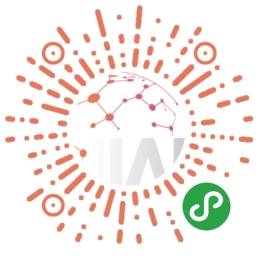
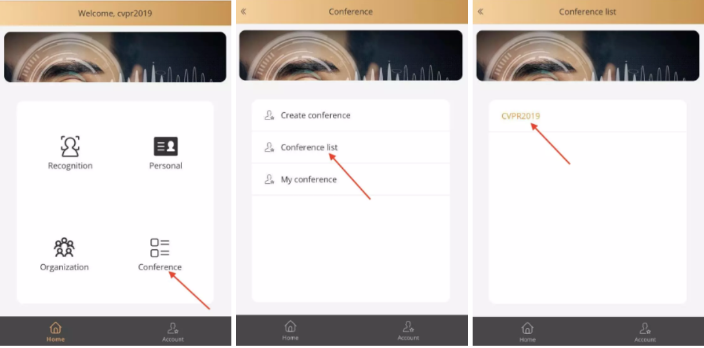
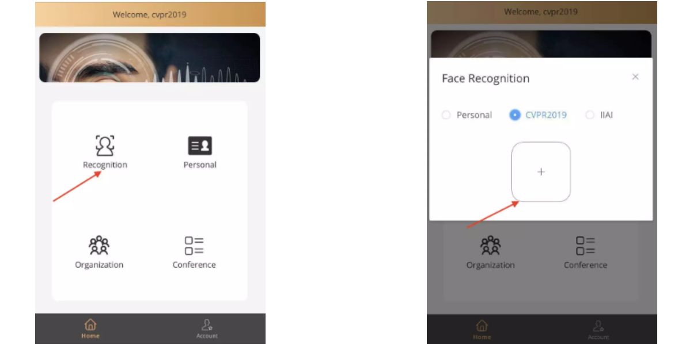
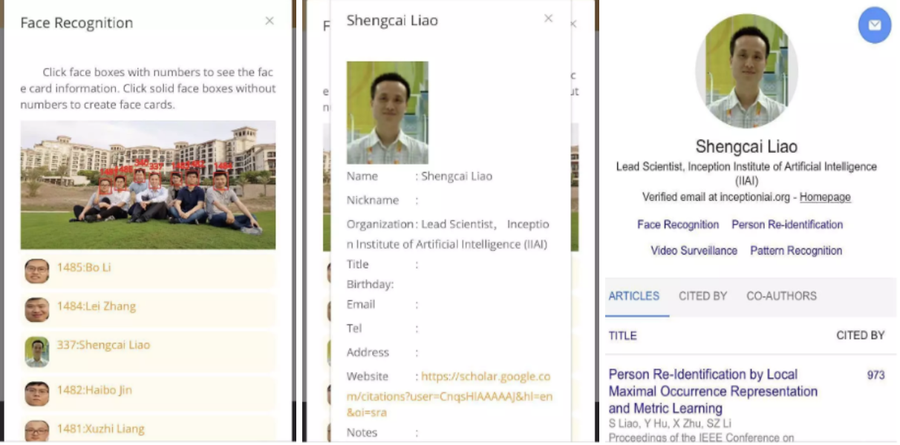
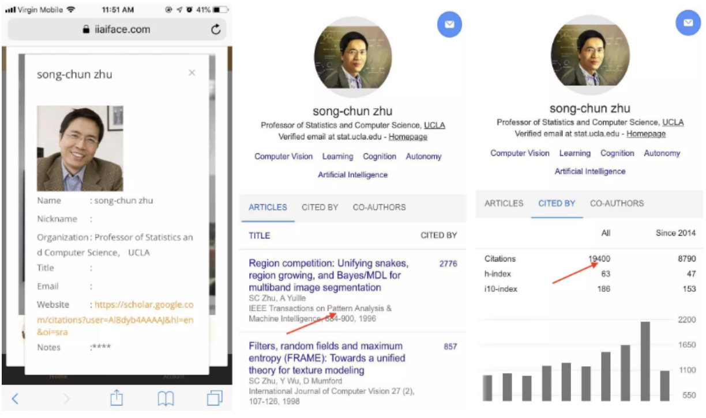
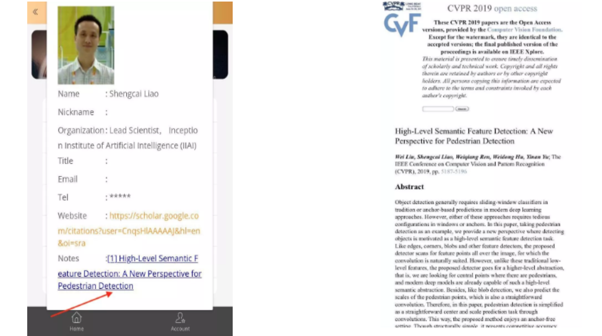
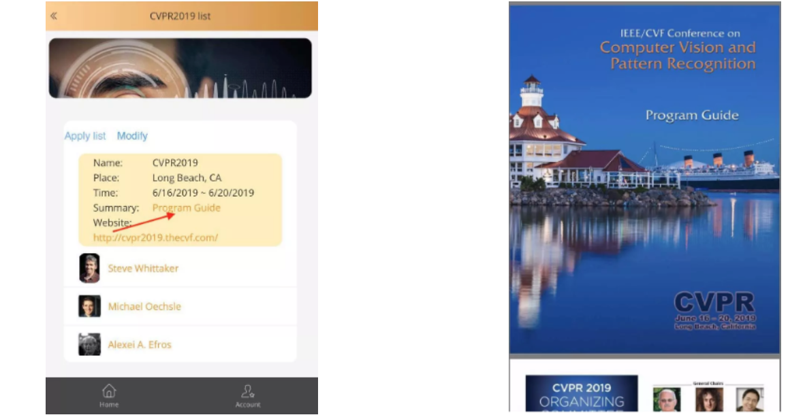

## 还在为脸盲而尴尬吗？IIAI推出人脸识别名片助理！

2019/07/03

你是否有过认识新朋友时问过对方名字，回头再见却怎么也想不起名字而尴尬？    你是否有过新加入一个单位时，看着很多似曾相识的同事却喊不出名字？特别是见到领导却不认识时很是窘迫？   你是否有过参加一个会议时，周围有很多大牛自己却不认识而懊恼？   记性不好的你，救星来了！IIAI推出人脸名片（FaceCard）应用，解决你脸盲的一切烦恼！

例如参加CVPR2019年度盛会，如何在会场更有效地进行学术交流？FaceCard参会利器了解一下？

如果你是安卓手机，请下载我们开发的安卓APP：https://www.iiaiface.com/facecard.apk（复制到浏览器打开，下载并安装）。如果是其他手机，请扫描下方小程序二维码（或在微信里搜索人脸名片小程序），或体验我们的在线版本：https://www.iiaiface.com/

  

注册帐号并创建自己的人脸名片后，点击首页的Conference，接着点击Conference list，然后找到列表里的CVPR2019后申请加入。

  

这时候就可以尝试识别功能了。点击首页的Recognition，选择CVPR2019，并拍照或选择相册里的照片上传，就可以进行识别了。

  

识别结果里会检测出人脸框、把识别出的人脸标上数字、并列出识别出的名字。对识别出的有数字的人脸框，可以点击查看其相应的人脸名片信息。如果名片里包含了作者的主页，可以点击查看主页了解作者的研究背景。

对于没有数字的实线人脸框，可以点击后创建该人脸的名片。创建的名片会进入个人通讯录，并在识别时可以选择通过个人通讯录进行识别。

  

问题来了，参会的时候如何知道你周边的人谁是牛人呢?   来，拿起手机，拍照识别，然后查看名片，点击谷歌主页，看看发表的论文和引用率就知道啦，是不是很机智？

  

那么，参会的时候如何让同行多了解你呢？记得创建名片的时候填上自己的个人主页或谷歌学术主页哦！

为了帮助大家更好地驰骋在CVPR会场畅快地交流，我们创建了CVPR2019作者数据库，包含1500+作者，并为作者们链接了谷歌学术主页，和这次CVPR发表的论文链接。所以，只要拍张照片识别出来，就可以愉快地了解和谈论对方的研究背景和这次发表的大作，还可以打开论文PDF当面探讨，尽情地享受学术交流零距离！

  

此外，我们还提供了CVPR2019官网链接和每日日程表，方便大家一APP在手，参会无忧！

  

在日常生活中，可以通过该APP对新认识的人创建人脸名片保存，供以后有需要时识别。那么，如何避免正面拍照识别时的尴尬呢？这里也教你几招：

* 多找机会拍合影；

* 开圆桌会议期间借机拍现场照；

* 拍报告人或主席台上的几个人；

* 开会逛海报时借机拍海报；

* 新员工初进公司很多同事都不认识，拍照不尴尬；

* 结合谷歌眼镜或类似的智能硬件；

欢迎补充……

我们后续将陆续推出企业HR功能，和企业考勤、会议签到等功能，敬请期待！

