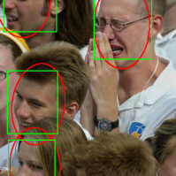
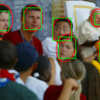
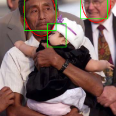
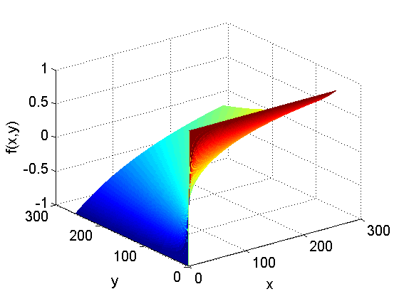
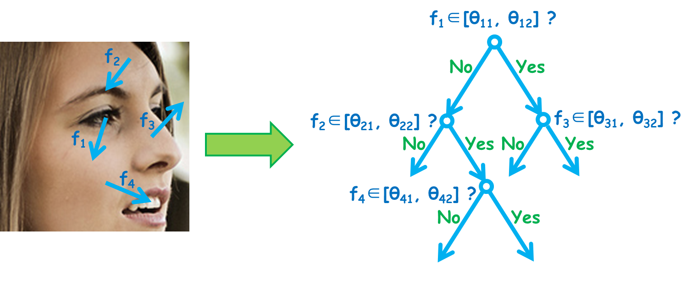
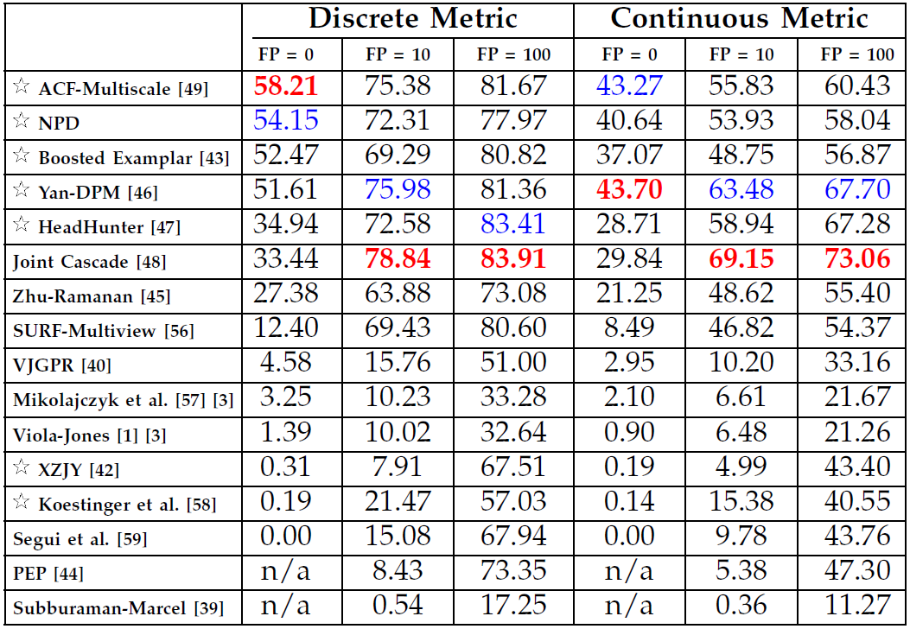
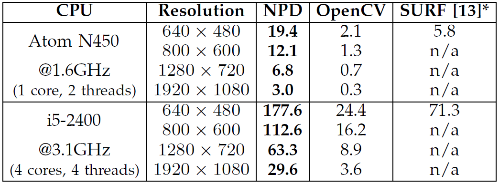
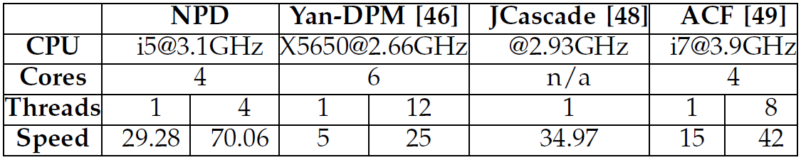

## A Fast and Accurate Unconstrained Face Detector

We propose a method to address challenges in unconstrained face detection, such as arbitrary pose variations and occlusions.

    <table>
        <tr>
            <td>
                
            </td>
            <td>
                
            </td>
            <td>
                
            </td>
        </tr>
    </table>
    Fig. 1. FDDB annotations (red ellipses) and NPD detections (green blocks).

First, a new image feature called Normalized Pixel Difference (NPD) is proposed. NPD feature is computed as the difference to sum ratio between two pixel values, inspired by the Weber Fraction in experimental psychology. The new feature is scale invariant, bounded, and is able to reconstruct the original image.

     
    Fig. 2. A plot of the NPD function f(x,y).

Second, we propose a deep quadratic tree to learn the optimal subset of NPD features and their combinations, so that complex face manifolds can be partitioned by the learned rules. This way, only a single soft-cascade classifier is needed to handle unconstrained face detection.

     
    Fig. 3. Learning and combining NPD features in a deep quadratic tree.

Furthermore, we show that the NPD features can be efficiently obtained from a look up table, and the detection template can be easily scaled, making the proposed face detector very fast. Experimental results on three public face datasets (FDDB, GENKI, and CMU-MIT) show that the proposed method achieves state-of-the-art performance in detecting unconstrained faces with arbitrary pose variations and occlusions in cluttered scenes.

### Download

* Detector code and the trained detectors: [NPDFaceDetector.zip](https://sourceforge.net/projects/openpr/files/code%20for%20an%20individual%20algorithm/NPDFaceDetector.zip)
* Training code: [NPDFaceDetector_Train.zip](https://sourceforge.net/projects/openpr/files/code%20for%20an%20individual%20algorithm/NPDFaceDetector_Train.zip)
* FDDB curves: [DiscROC.txt](https://1drv.ms/t/s!AtFUxkZAZIU-dj9Tj2ngirTTc-8)   [ContROC.txt](https://1drv.ms/t/s!AtFUxkZAZIU-dxyBMkFDlBueA6w)

### Results

    Table 1. Detection accuracy on FDDB. 
     
    Table 2. Detection speed – frontal. 
     
    Table 3. Detection speed – unconstrained. 
     

### Contact

National Laboratory of Pattern Recognition, Institute of Automation, Chinese Academy of Sciences.

### References

[1]Shengcai Liao, Anil K. Jain, and Stan Z. Li, “A Fast and Accurate Unconstrained Face Detector,” IEEE Transactions on Pattern Analysis and Machine Intelligence, 2015 (Accepted). [[pdf](../doc/liao-pami15-npd.pdf)]

Last updated: Oct. 8, 2015

