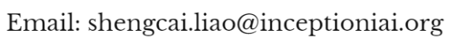

## Benchmark of Large-scale Unconstrained Face Recognition

Many efforts have been made in recent years to tackle the unconstrained face recognition challenge. For the benchmark of this challenge, the Labeled Faces in the Wild ([LFW](http://vis-www.cs.umass.edu/lfw/)) [[2](https://liaosc.wordpress.com/2019/01/13/benchmark-of-large-scale-unconstrained-face-recognition/#2)] database has been widely used. However, the standard LFW protocol is very limited:

<ol>
    <li>Only 3,000 genuine and 3,000 impostor matches for classification.</li>
    <li>Today a 97% accuracy can be achieved with this benchmark, remaining a very limited room for algorithm development. However, we argue that this accuracy may be too optimistic because the underlying false accept rate (FAR) may still be high (e.g. 3%).</li>
    <li>Performance evaluation at low FARs is not statistically sound by the standard protocol due to the limited number of impostor matches.</li>
</ol>

Thereby we develop a new benchmark protocol to fully exploit all the 13,233 LFW face images for large-scale unconstrained face recognition evaluation. The new benchmark protocol, called BLUFR, contains both verification and open-set identification scenarios, with a focus at low FARs. There are 10 trials of experiments, with each trial containing about 156,915 genuine matching scores and 46,960,863 impostor matching scores on average for performance evaluation.

We provide a benchmark tool here to further advance research in this field. For more information, please read our [IJCB paper](https://liaosc.files.wordpress.com/2019/01/liao-ijcb14-blufr.pdf) and the README files in the [benchmark tookit](https://1drv.ms/u/s!AtFUxkZAZIU-cLSxFro3AwGdnAE).

### Download:

* The benchmark tookit: [BLUFR.zip](https://1drv.ms/u/s!AtFUxkZAZIU-cLSxFro3AwGdnAE)
* The basic feature files: [lfw.mat](https://1drv.ms/u/s!AtFUxkZAZIU-cziDq5D5fkRMA20)  [frgc.mat](https://1drv.ms/u/s!AtFUxkZAZIU-cRrkFWOQ_w23eXY)
* Other available features: [HighDimLBP](https://skydrive.live.com/redir?resid=D472C693301B900F!120&authkey=!AEHeXXePhsJdrfk)  [LE](https://skydrive.live.com/redir?resid=D472C693301B900F!109&authkey=!AHC4sGY3p8_xNAA)  –Thanks to [Dong Chen](http://home.ustc.edu.cn/~chendong/)

### Results:

    <table>
        <tr>
            <td>
                
            </td>
            <td>
                
            </td>
        </tr>
    </table>
    

  

Note: 

(1) Algorithms are ranked by VR @FAR=0.1%.

(2) Performances are measured in (μ – σ) of 10 trials.

(3) The citations indicate where the results are from.

Download the result files and demo code for performance plot: [Results.zip](https://1drv.ms/u/s!AtFUxkZAZIU-ckrIlVgn-uAWl_E)

Please contribute your algorithm’s performance so that we can keep a track of the state of the art for large-scale unconstrained face recognition.

### Contact:

National Laboratory of Pattern Recognition, Institute of Automation, Chinese Academy of Sciences.

### References:

[1] Shengcai Liao, Zhen Lei, Dong Yi, Stan Z. Li, “A Benchmark Study of Large-scale Unconstrained Face Recognition.” In IAPR/IEEE International Joint Conference on Biometrics, Sep. 29 – Oct. 2, Clearwater, Florida, USA, 2014. [[pdf](https://liaosc.files.wordpress.com/2019/01/liao-ijcb14-blufr.pdf)] [[slides](https://liaosc.files.wordpress.com/2019/01/ijcb2014-blufr.pdf)]

[2] G. B. Huang, M. Ramesh, T. Berg, and E. Learned-Miller. Labeled faces in the wild: A database for studying face recognition in unconstrained environments. Technical Report 07-49, University of Massachusetts, Amherst, October 2007.

Last updated: Jul. 31, 2014

