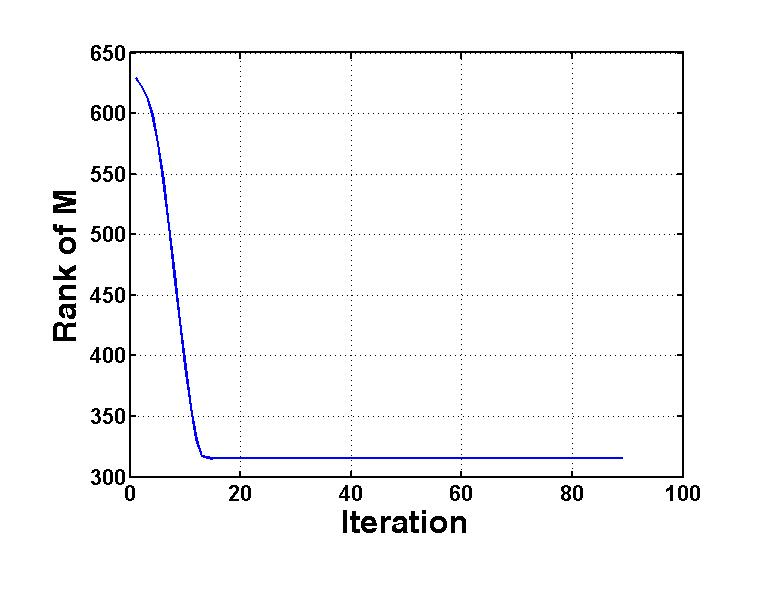
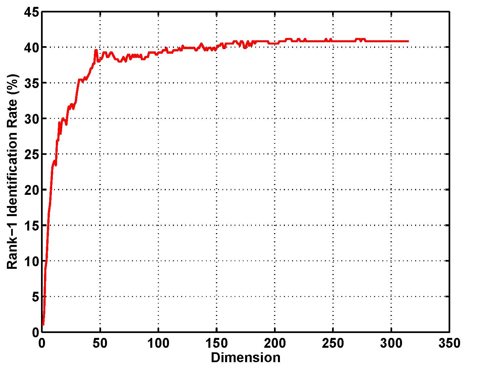
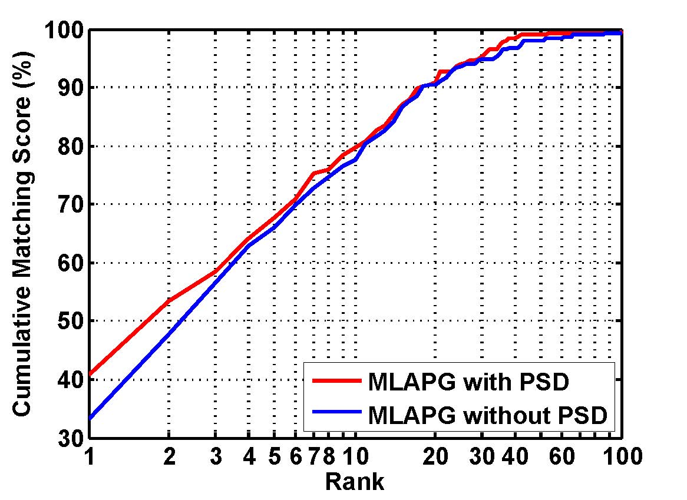
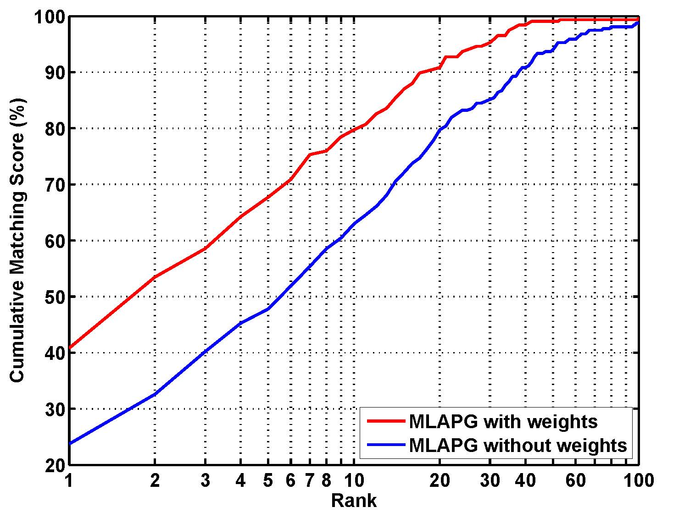
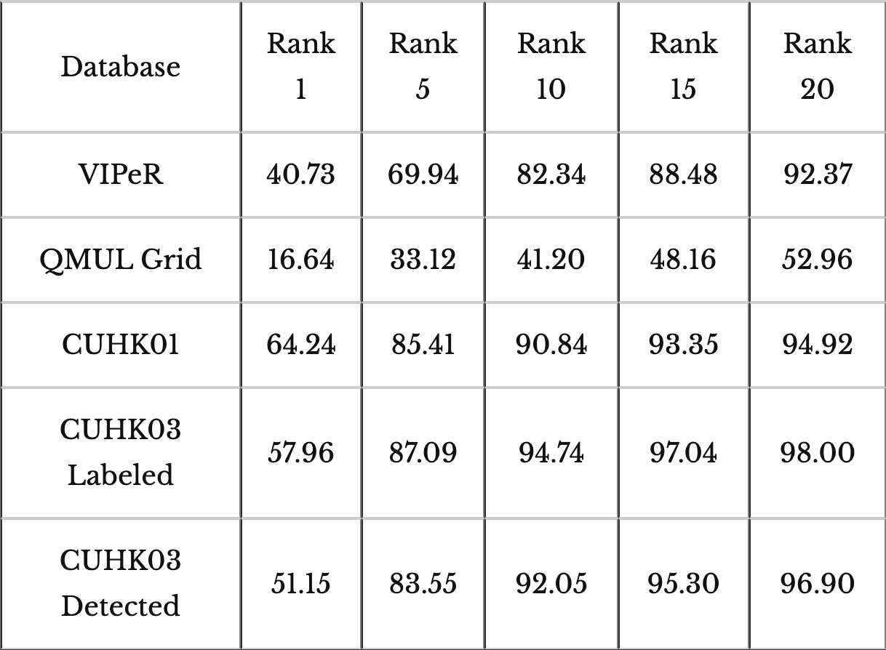

## Efficient PSD Constrained Asymmetric Metric Learning for Person Re-identification

### Problems with existing metric learning methods

* Applying PSD: expensive
* No PSD: noisy
* pos/neg samples: largely unbalanced

### Contributions

* APG solution to the PSD constrained logistic metric learning problem
* Asymmetric pos/neg sample weights to balance pos/neg costs

### Advantages

* PSD+APG leads to low rank and smooth metric
* APG solution is fast in convergence
* PSD and asymmetric weights lead to notable improvements

### Download

* Download: [MLAPG.zip](https://sourceforge.net/projects/openpr/files/code%20for%20an%20individual%20algorithm/MLAPG.zip)
* CMC curves: [cmc_curves.zip](https://1drv.ms/u/s!AtFUxkZAZIU-eIQS6rK5mI2t1sw)

### Results

    <table style="margin-left: auto; margin-right: auto;">
        <tr>
            <td>
                

                     
                    Fig. 1. Fast rank shrinkage.
                

            </td>
            <td>
                

                     
                    Fig. 2. Effect of low rank selection.
                

            </td>
        </tr>
        <tr>
            <td>
                

                     
                    Fig. 3. Improvement by PSD.
                

            </td>
            <td>
                

                     
                    Fig. 4. Improvement by weighting.
                

            </td>
        </tr>
    </table>

  Table 1. Summary of results (%) for the proposed MLAPG algorithm 
     

Note: CMC curves of the proposed MLAPG algorithm can be downloaded in [cmc_curves.zip](https://1drv.ms/u/s!AtFUxkZAZIU-eIQS6rK5mI2t1sw)

### Contact:

National Laboratory of Pattern Recognition, Institute of Automation, Chinese Academy of Sciences.

### References:

[1]Shengcai Liao and Stan Z. Li, “Efficient PSD Constrained Asymmetric Metric Learning for Person Re-identification.” In IEEE International Conference on Computer Vision (ICCV 2015), December 11-18, Santiago, Chile, 2015. [[pdf](../doc/liao-iccv15-mlapg-1.pdf)] [[poster](../doc/mlapg_iccv2015_poster-1.pdf)]

Last updated: Dec. 8, 2015

