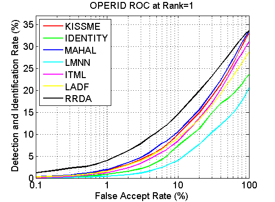
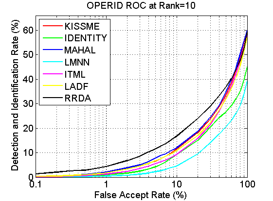
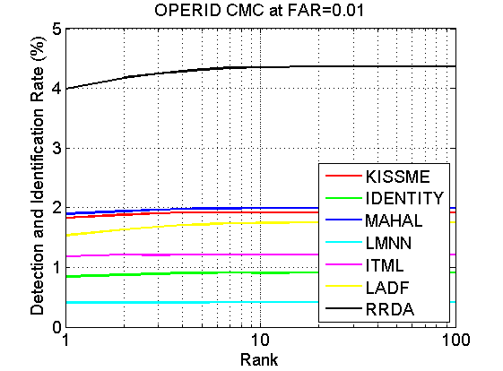
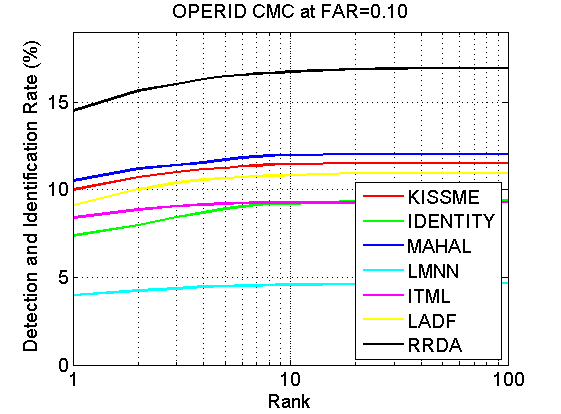
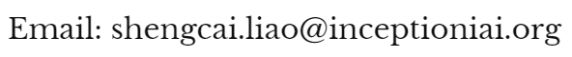

## Open-set Person Re-identification Database and Evaluation v1.0

Person re-identification is becoming a hot research for developing both machine learning algorithms and video surveillance applications. The task of person re-identification is to determine which person in a gallery has the same identity to a probe image. This task basically assumes that the subject of the probe image belongs to the gallery, that is, the gallery contains this person. However, in practical applications such as searching a suspect in a video, this assumption is usually not true. In this paper, we consider the open-set person re-identification problem, which includes two sub-tasks, detection and identification. The detection sub-task is to determine the presence of the probe subject in the gallery, and the identification sub-task is to determine which person in the gallery has the same identity as the accepted probe. We present a database collected from a video surveillance setting of 6 cameras, with 200 persons and 7,413 images segmented. Based on this database, we develop a benchmark protocol for evaluating the performance under the open-set person re-identification scenario. Several popular metric learning algorithms for person re-identification have been evaluated as baselines. From the baseline performance, we observe that the open-set person re-identification problem is still largely unresolved, thus further attention and effort is needed.

We provide the OPeRID v1.0 database, baseline features, and a benchmark toolkit here to further advance research in this field. For more information, please read our paper[[1](https://liaosc.wordpress.com/2019/01/13/open-set-person-re-identification-database-and-evaluation-v1-0-2/#1)].

### Download

* Benchmark toolkit:  [toolkit.zip](https://1drv.ms/u/s!AtFUxkZAZIU-dIU7qjRgQNR_xC8)
* Baseline features:  [features.zip](https://1drv.ms/u/s!AtFUxkZAZIU-effI6BduEVuX85Q)
* License agreement: [OPeRID v1.0 Database License Agreement](https://liaosc.files.wordpress.com/2019/01/operid-v1.0-database-license-agreement.pdf)

Note: License agreement is only required if you would like to obtain the original images of the OPeRID v1.0 database.

### Results

    <table>
        <tr>
            <td>
                
            </td>
            <td>
                
            </td>
        </tr>
        <tr>
            <td>
                
            </td>
            <td>
                
            </td>
        </tr>
    </table>
    Table 1. OPeRID Performances measured in (μ – σ) of 10 trials
  <table>
    <tr>
        <td rowspan="2">Method</td>
        <td colspan="2">FAR=1%</td>
        <td colspan="2">FAR=10%</td>
    </tr>
    <tr>
        <td>Rank=1</td>
        <td>Rank=10</td>
        <td>Rank=1</td>
        <td>Rank=10</td>
    </tr>
    <tr>
        <td>IDENTITY</td>
        <td>0.84</td>
        <td>0.91</td>
        <td>7.36</td>
        <td>9.21</td>
    </tr>
    <tr>
        <td>MAHAL</td>
        <td>1.89</td>
        <td>1.99</td>
        <td>10.50</td>
        <td>11.97</td>
    </tr>
    <tr>
        <td>KISSME</td>
        <td>1.82</td>
        <td>1.92</td>
        <td>9.99</td>
        <td>11.46</td>
    </tr>
    <tr>
        <td>LMNN</td>
        <td>0.41</td>
        <td>0.41</td>
        <td>3.97</td>
        <td>4.58</td>
    </tr>
    <tr>
        <td>ITML</td>
        <td>1.18</td>
        <td>1.21</td>
        <td>8.39</td>
        <td>9.27</td>
    </tr>
    <tr>
        <td>LADF</td>
        <td>1.53</td>
        <td>1.74</td>
        <td>9.11</td>
        <td>10.82</td>
    </tr>
    <tr>
        <td>RRDA</td>
        <td>3.99</td>
        <td>4.35</td>
        <td>14.51</td>
        <td>16.72</td>
    </tr>
</table>

  

Download the result files and demo code for performance plot: [results.zip](https://1drv.ms/u/s!AtFUxkZAZIU-df3SIl9aGHLdplo)

### Contact

National Laboratory of Pattern Recognition, Institute of Automation, Chinese Academy of Sciences.

### References

[1]Shengcai Liao, Zhipeng Mo, Jianqing Zhu, Yang Hu, and Stan Z. Li, “Open-set Person Re-identification,” arXiv:1408.0872, 2014. [[pdf](../doc/operid.pdf)]

Last updated: Oct. 16, 2014

