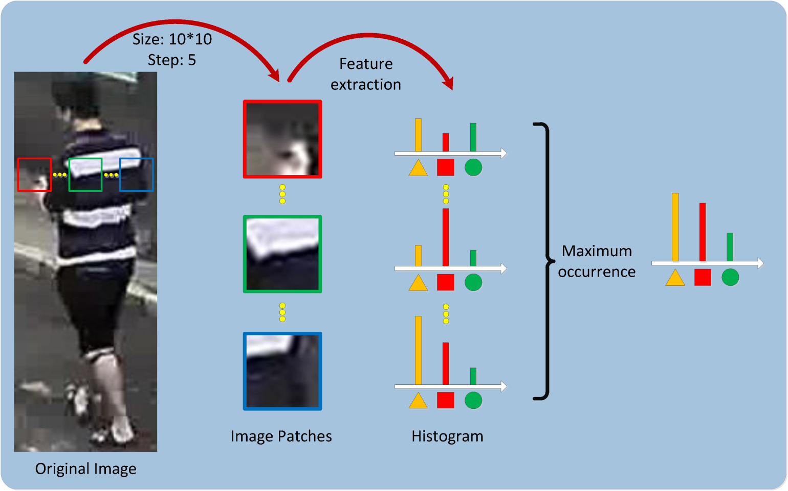
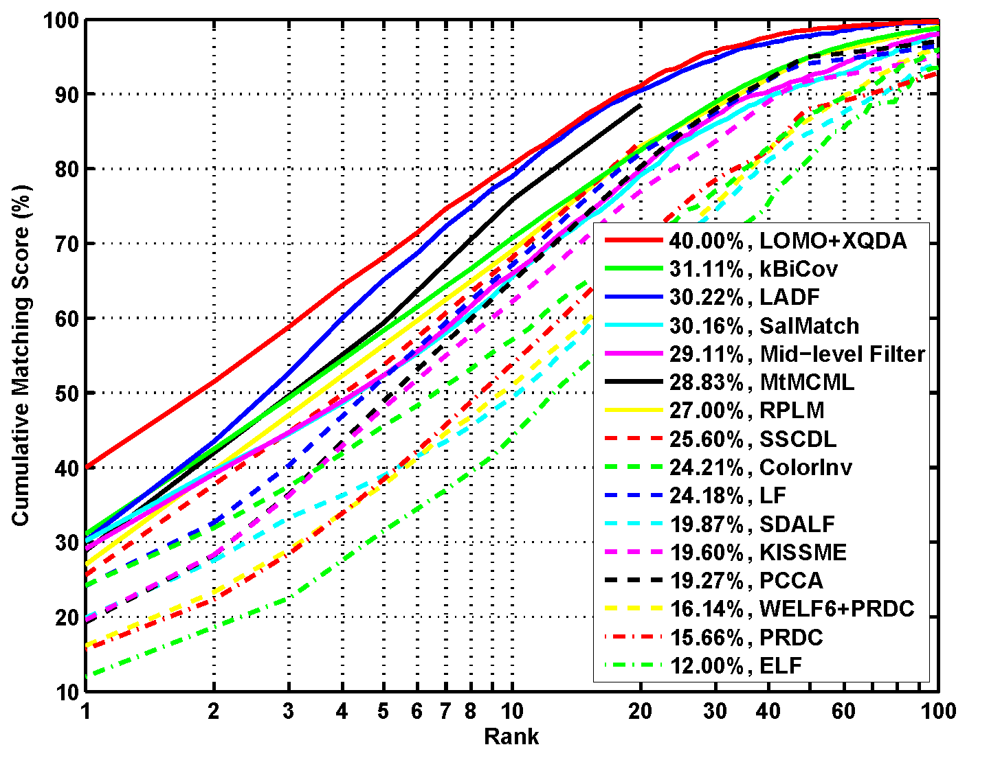
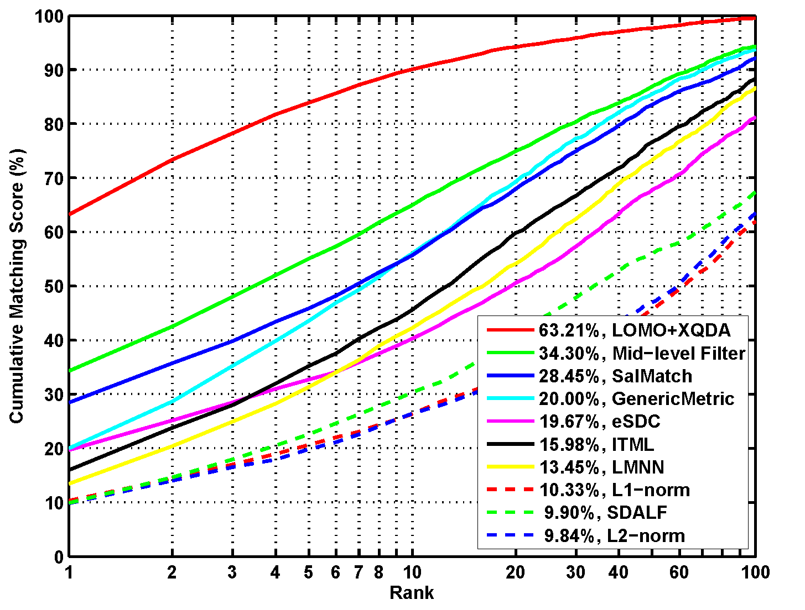
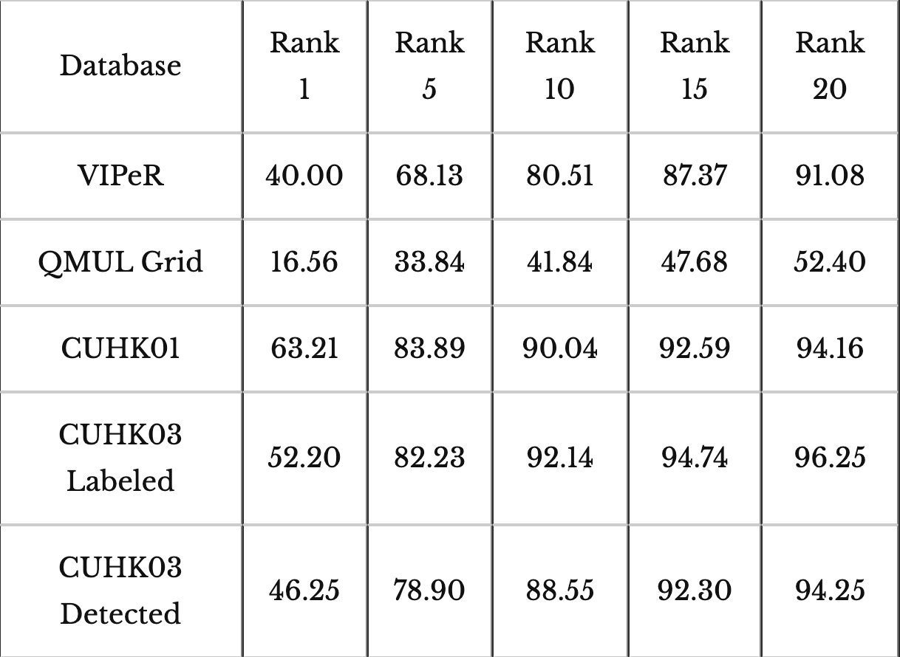

## Person Re-identification by Local Maximal Occurrence Representation and Metric Learning

An effective feature representation called Local Maximal Occurrence (LOMO), and a subspace and metric learning method called Cross-view Quadratic Discriminant Analysis (XQDA) are proposed for person re-identification. The LOMO feature analyzes the horizontal occurrence of local features, and maximizes the occurrence to make a stable representation against viewpoint changes.

    

Besides, to handle illumination variations, we apply the Retinex transform and the Scale Invariant Local Ternary Pattern (SILTP). To learn a discriminant metric, we propose to learn a discriminant low dimensional subspace by cross-view quadratic discriminant analysis, and simultaneously, a QDA metric is learned on the derived subspace. We also present a practical computation method for XQDA, as well as its regularization. Experiments on four challenging person re-identification databases, VIPeR, QMUL GRID, CUHK Campus, and CUHK03, show that the proposed method improves the state-of-the-art rank-1 identification rates by 2.2\%, 4.88\%, 28.91\%, and 31.55\% on the four databases, respectively.

### Download:

* Source code: [LOMO_XQDA.zip](https://sourceforge.net/projects/openpr/files/code%20for%20an%20individual%20algorithm/LOMO_XQDA.zip)
* Extracted features:  [lomo_viper+grid.zip](https://1drv.ms/u/s!AtFUxkZAZIU-emOD7CNTanFde2s)  [cuhk01_lomo.mat](https://1drv.ms/u/s!AtFUxkZAZIU-e1ey0NuWiuNLoY0)  [cuhk03_labeled_lomo.mat](https://1drv.ms/u/s!AtFUxkZAZIU-fV4rmS5A_RLpdf4)  [cuhk03_detected_lomo.mat](https://1drv.ms/u/s!AtFUxkZAZIU-fGiiCxsjxR0yRJw)

### Results:

    <table>
        <tr>
            <td>
                 
                CMC curves on the VIPeR database
            </td>
            <td>
                 
                CMC curves on the CUHK01 (CUHK Campus) database
            </td>
        </tr>
    </table>
     

  

Note: 
the [source code package](http://www.openpr.org.cn/index.php/Code-For-Image-Processing-And-Computer-Vision/102-LOMO-Feature-Extraction-and-XQDA-Metric-Learning-for-Person-Re-identification/View-details.html) contains the CMC curves for performance plot.

### Contact:

National Laboratory of Pattern Recognition, Institute of Automation, Chinese Academy of Sciences.

### References:

[1]Shengcai Liao, Yang Hu, Xiangyu Zhu, and Stan Z. Li, “Person Re-identification by Local Maximal Occurrence Representation and Metric Learning.” In IEEE International Conference on Computer Vision and Pattern Recognition, June 7-12, Boston, Massachusetts, USA, 2015. [[pdf](../doc/liao-cvpr15-lomo-xqda.pdf)]

Last updated: May 7, 2015

